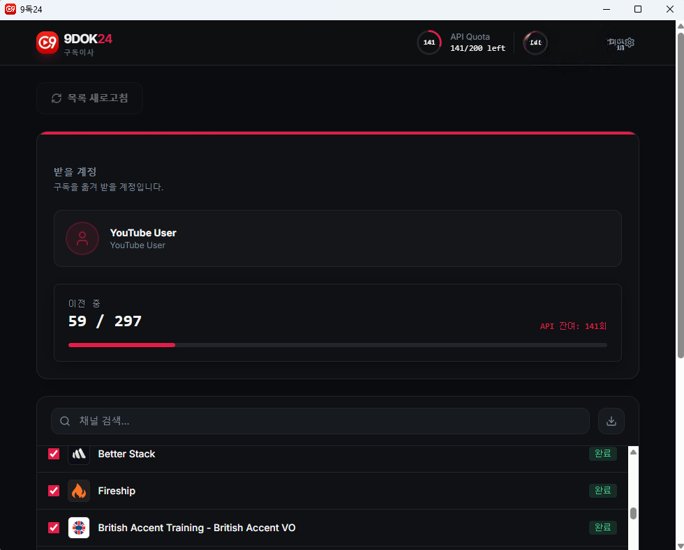

# 9dok24 — 구독이사

<div align="center">

**Language / 언어 선택**

🇰🇷 **한국어** | [🇺🇸 English](README.md) | [🇫🇷 Français](README.fr.md) | [🇨🇳 中文](README.zh.md) | [🇯🇵 日本語](README.ja.md)

</div>

---

YouTube 구독 목록을 다른 Google 계정으로 빠르고 간편하게 옮겨주는 Electron 데스크톱 앱입니다.

---

## 주요 기능

- **구독 목록 불러오기** — 소스 계정의 YouTube 구독 채널 전체를 조회합니다.
- **선택적 이전** — 채널을 검색하고 원하는 항목만 골라서 옮길 수 있습니다.
- **자동 중복 제거** — 대상 계정에 이미 구독된 채널은 건너뜁니다.
- **API 할당량 게이지** — 앱에서 추적한 YouTube Data API 일일 삽입 횟수를 200회 한도 기준으로 표시합니다.
- **JSON 내보내기** — 구독 목록을 JSON 파일로 저장할 수 있습니다.
- **다크 / 라이트 테마** — 앱 내 설정에서 전환 가능합니다.
- **한국어 / English** — 언어 전환을 지원합니다.

---

## 스크린샷



*297개 채널 이전 중 — 59개 완료, 상단에 API 할당량 게이지가 보이는 화면.*

---

## 시작하기

### 1. Google Cloud 설정 (필수)

앱을 처음 실행하면 OAuth 자격증명 입력 화면이 나타납니다. 아래 절차로 자격증명을 준비하세요.

1. [Google Cloud Console](https://console.cloud.google.com/) → 새 프로젝트 생성
2. **YouTube Data API v3** 활성화
3. **OAuth 동의 화면** 구성 → 테스트 사용자(본인 계정들) 추가
4. **사용자 인증 정보** → **OAuth 클라이언트 ID 만들기** → 유형: **데스크톱 앱**
5. 생성된 **Client ID** 와 **Client Secret** 을 앱에 입력

### 2. 앱 실행

```bash
npm install
npm run dev
```

### 3. 구독 이전 절차

1. **Google 계정으로 로그인** — 구독을 *보낼* 계정으로 로그인합니다.
2. **구독 목록 불러오기** — 현재 계정의 YouTube 구독 채널이 표시됩니다.
3. **채널 선택** — 옮길 채널을 선택합니다 (기본: 전체 선택).
4. **구독 옮기기** — *받을* Google 계정으로 로그인 후 이전을 시작합니다.

> **API 할당량 주의:** YouTube Data API는 하루 구독 삽입 200회 한도가 있습니다. 한도 초과 시 다음 날 이어서 진행하세요. 이미 완료된 채널은 자동으로 건너뜁니다.

---

## 기술 스택

| 영역 | 사용 기술 |
|------|-----------|
| 런타임 | Electron 41 |
| UI 프레임워크 | React 18 + TypeScript |
| 빌드 도구 | Vite + vite-plugin-electron |
| 스타일 | Tailwind CSS + shadcn/ui (Radix) |
| 애니메이션 | Framer Motion |
| API | YouTube Data API v3 (OAuth2 PKCE) |
| 테스트 | Vitest + Testing Library, Playwright |

---

## 개발 명령어

```bash
npm run dev          # Vite 개발 서버 + Electron 실행 (localhost:8080)
npm run build        # TypeScript 컴파일 + Vite 프로덕션 빌드
npm run lint         # ESLint 검사
npm run test         # Vitest 단위 테스트 (1회)
npm run test:watch   # Vitest 감시 모드
npm run pack         # electron-builder --dir → release/win-unpacked/
npm run dist         # electron-builder 전체 인스톨러 → release/
```

---

## 라이선스

[MIT](LICENSE) © 2026 9dok24
