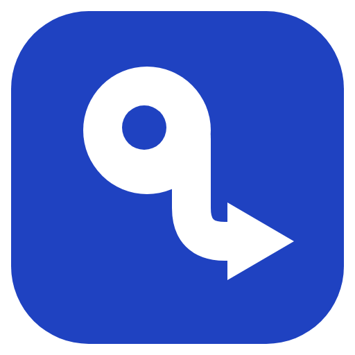
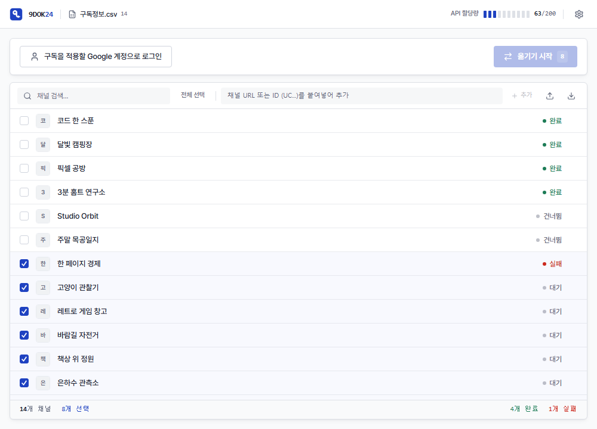

# 9dok24 — 구독이사

<div align="center">

<p>
  
</p>

**Language / 언어 선택**

🇰🇷 **한국어** | [🇺🇸 English](README.md) | [🇫🇷 Français](README.fr.md) | [🇨🇳 中文](README.zh.md) | [🇯🇵 日本語](README.ja.md)

</div>

---

Google Takeout CSV로 YouTube 구독 목록을 다른 Google 계정에 옮기는 데스크톱 앱입니다. 소스 계정 로그인이 필요 없고, 선택적으로, 며칠에 걸쳐 이어서 옮길 수 있습니다.

---

## 주요 기능

- **Takeout CSV 가져오기** — Google Takeout의 `구독정보.csv`를 클릭 또는 드래그&드롭으로 불러옵니다. 소스 계정 로그인이 아예 필요 없습니다.
- **로컬 저장** — 가져온 목록과 채널별 진행 상태(완료/건너뜀/실패/대기)가 로컬에 저장됩니다. CSV는 최초 한 번만, 이후 실행은 이어서 진행됩니다.
- **로그인 없이 목록 편집** — 채널 URL이나 `UC…` ID 붙여넣기로 추가, 행별 삭제, 부분 선택. 전부 오프라인으로 동작합니다.
- **자동 중복 제거** — 대상 계정에 이미 구독된 채널은 사전에 감지해 할당량 소모 없이 건너뜁니다.
- **썸네일·채널명 자동 보완** — 로그인하면 채널 아바타와 빈 제목을 50개 단위 배치(호출당 1 unit)로 조회해 캐시합니다.
- **API 할당량 미터** — 상단바의 세그먼트 게이지가 일일 구독 삽입 횟수를 200회 한도 기준으로 추적합니다.
- **취소 가능한 OAuth** — 로그인은 최대 5분 대기하며 언제든 취소할 수 있습니다.
- **JSON 내보내기** — 상태 포함 목록을 JSON으로 저장합니다.
- **라이트 / 다크 테마** — 라이트 기본, 앱 내 전환. UI는 한국어/English/Français/中文/日本語 지원.

---

## 스크린샷



*콘솔 화면: 채널별 상태가 표시되는 원장, 대상 계정 연결과 실행 컨트롤, 상단바의 API 할당량 미터.*

---

## 시작하기

### 1. Google Cloud 설정 (필수)

앱을 처음 실행하면 OAuth 자격증명 입력 화면이 나타납니다.

1. [Google Cloud Console](https://console.cloud.google.com/) → 새 프로젝트 생성
2. **YouTube Data API v3** 활성화
3. **OAuth 동의 화면** 구성 → 앱은 *테스트* 상태로 두고, 구독을 받을 계정을 **테스트 사용자**로 추가
4. **사용자 인증 정보** → **OAuth 클라이언트 ID 만들기** → 유형: **데스크톱 앱**
5. 생성된 **Client ID** 와 **Client Secret** 을 앱에 입력

### 2. 구독 CSV 준비

1. *소스* 계정으로 [Google Takeout](https://takeout.google.com/) 접속
2. **YouTube 및 YouTube Music**만 선택 → **구독정보** 포함
3. 내보내기 후 압축을 풀어 `구독정보.csv`(영문 로케일은 `subscriptions.csv`)를 찾습니다

### 3. 앱 실행

```bash
npm install
npm run dev
```

### 4. 구독 이전 절차

1. **CSV 가져오기** — 드롭존 클릭 또는 파일 드래그. 목록이 로컬에 저장되므로 최초 한 번이면 됩니다.
2. **목록 확인** — 검색, 선택 해제, 행 삭제, URL/ID로 채널 추가.
3. **받을 계정으로 로그인** — 브라우저에 구글 동의 화면이 열립니다 (개인 OAuth 클라이언트는 "확인되지 않은 앱" 경고가 정상입니다: *고급 → 계속*).
4. **구독 옮기기** — 이미 구독된 채널은 건너뛰고, 나머지를 하나씩 구독하며 행마다 실시간 상태가 표시됩니다.

> **API 할당량 주의:** YouTube Data API는 하루 구독 삽입 약 200회 한도가 있습니다 (태평양 시간 자정 = 한국시간 오후 4~5시경 리셋). 한도 초과 시 다음 날 다시 실행하면 완료된 채널은 기억되어 건너뜁니다.

---

## 기술 스택

| 영역 | 사용 기술 |
|------|-----------|
| 런타임 | Electron 41 |
| UI 프레임워크 | React 18 + TypeScript |
| 빌드 도구 | Vite + vite-plugin-electron |
| 스타일 | Tailwind CSS + shadcn/ui (Radix) |
| 애니메이션 | Framer Motion |
| API | YouTube Data API v3 (OAuth2 PKCE) |
| 테스트 | Vitest + Testing Library, Playwright |

---

## 개발 명령어

```bash
npm run dev          # Vite 개발 서버 + Electron 실행 (localhost:8080)
npm run build        # TypeScript 컴파일 + Vite 프로덕션 빌드
npm run lint         # ESLint 검사
npm run test         # Vitest 단위 테스트 (1회)
npm run test:watch   # Vitest 감시 모드
npm run pack         # electron-builder --dir → release/win-unpacked/
npm run dist         # electron-builder 전체 인스톨러 → release/
```

일반 브라우저로 `localhost:8080`을 열면 개발 전용 Electron API 목(mock)이 동작해
(`?mock=list` / `?mock=empty` / `?mock=setup`) Electron 없이 UI 작업을 할 수 있습니다.

---

## 라이선스

[MIT](LICENSE) © 2026 9dok24
